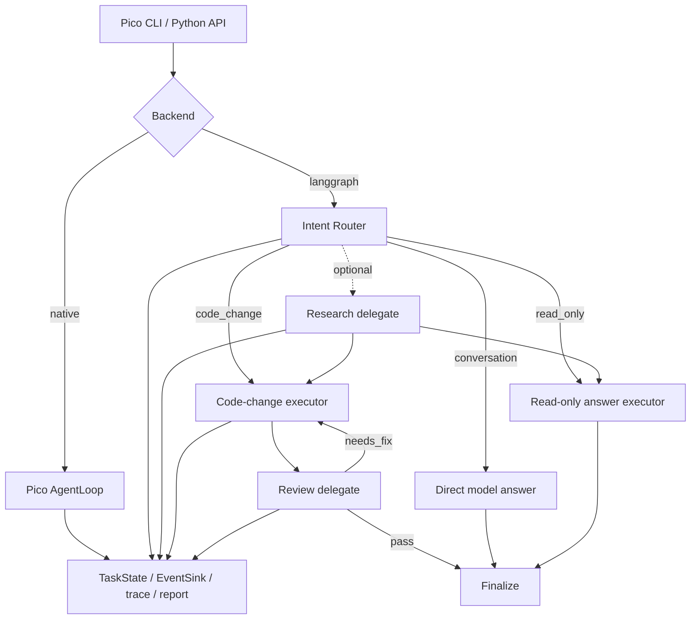

# Pico LangGraph Harness

一个面向本地代码仓库的轻量级 Agent Harness。在保留 Pico 原生运行时的基础上，本项目增加了可选的 LangGraph 编排后端、受约束的任务意图路由、Coordinator / Research / Review 三角色协作、执行审计和双后端评测。

本项目的重点不是简单地“套一层 LangGraph”，而是验证一套可解释、可约束、可评测的 Agent 工程方案：模型负责提出决策，代码负责权限边界，执行过程能够审计，原生行为能够回归。

> 上游项目：[htxoffical/pico](https://gitee.com/htxoffical/pico)。本仓库是在 Pico 基础上的二次工程化改造，原始项目及其成果归原作者。本仓库新增内容主要集中在 LangGraph wrapper、三角色协作、意图路由、Agent Harness、评测与测试。

## 项目亮点

| 能力 | 实现 |
| --- | --- |
| 双后端 | `native` 保留 Pico 原生 AgentLoop；`langgraph` 作为可选 wrapper 接入 |
| 任务意图路由 | 支持 `auto / conversation / read_only / code_change`，严格 JSON 协议，连续非法输出后 fail closed |
| 三角色协作 | Coordinator 负责主流程，Research 只读调研，Review 只读验收代码修改 |
| 权限约束 | Router 不能授予工具权限；只读分支、delegate allowlist、workspace sandbox 和审批策略由代码强制 |
| 隔离执行 | Research、Review 和节点执行器使用内存 session，禁止写父 checkpoint 和 durable memory |
| 过程审计 | 通过 EventSink、TaskState、JSONL trace 和 report 记录路由、模型、工具、delegate、Review 与失败终态 |
| 可重复评测 | native / LangGraph 共用 benchmark runner，结果写入 artifact v2，并保留预算、审计和失败分类指标 |
| 原生兼容 | LangGraph 不替换 Pico runtime；原有 CLI、session、memory、checkpoint 和 native benchmark 保持可用 |

## 架构



### 意图与能力边界

| 模式 | 适用任务 | 工具能力 | Patch Review |
| --- | --- | --- | --- |
| `conversation` | 问候、概念解释、无需仓库证据的回答 | 不创建工具执行器 | 不调用 |
| `read_only` | 项目分析、代码搜索、文件解释 | `list_files / read_file / search` 与父 allowlist 的交集 | 不调用 |
| `code_change` | 新增、修改或删除工作区内容 | 继承父 Coordinator 工具，但移除 `delegate` | 必须调用 |
| `auto` | 由受约束 Router 选择上述意图 | Router 只分类，不参与授权 | 由最终意图决定 |

混合任务只要最终需要修改工作区，就归类为 `code_change`。即使 Router 判定为代码修改，也不代表自动获得写权限；风险工具仍受 `--approval`、工具 allowlist 和 workspace sandbox 控制。

## 为什么这样设计

- **LangGraph 是可选 wrapper**：原生 AgentLoop 已经具备工具执行、分层记忆、checkpoint 和 session，不需要为了展示框架而替换稳定运行时。
- **Router 不是第四个 Agent**：它只执行无工具的结构化分类，最多尝试两次，不拥有 session、checkpoint 或写权限。
- **Research 与 Review 都是只读 child agent**：角色能力通过固定 allowlist 强制，避免多 Agent 协作演变成权限扩散。
- **benchmark 不调用 Router**：评测任务显式固定为 `code_change`，保证 FakeModel 调用顺序和结果可重复。
- **控制流不依赖 trace 文件**：EventSink 只做旁路观测，`affected_paths` 等执行事实保存在内存状态和 TaskState 中。

## 安装

需要 Python 3.10+。

```bash
python -m venv .venv
```

Windows CMD：

```cmd
.venv\Scripts\activate.bat
python -m pip install -e .
python -m pip install -e examples\langgraph-pico
```

Linux / macOS：

```bash
source .venv/bin/activate
python -m pip install -e .
python -m pip install -e examples/langgraph-pico
```

第二条 editable install 只为 LangGraph 后端提供依赖和包入口；只使用 native 后端时可以不安装。

## 模型配置

复制环境变量模板：

```cmd
copy .env.example .env
```

只填写实际使用的 provider。真实密钥必须保存在本地 `.env`，不要提交到仓库。

```env
PICO_OPENAI_API_BASE=https://your-openai-compatible-endpoint/v1
PICO_OPENAI_API_KEY=your-api-key
PICO_OPENAI_MODEL=your-model
```

支持的 provider：

| provider | CLI | 主要配置 |
| --- | --- | --- |
| DeepSeek compatible | `--provider deepseek` | `PICO_DEEPSEEK_API_BASE / API_KEY / MODEL` |
| OpenAI compatible | `--provider openai` | `PICO_OPENAI_API_BASE / API_KEY / MODEL` |
| Anthropic compatible | `--provider anthropic` | `PICO_ANTHROPIC_API_BASE / API_KEY / MODEL` |
| Ollama | `--provider ollama` | `--host / --model`，不需要 API key |

配置优先级：

```text
CLI 显式参数 > 项目 .env 中的 PICO_* 变量 > 兼容环境变量 > 代码默认值
```

## 使用方式

### 原生 Pico

默认 backend 仍是 native：

```cmd
python -m pico run --backend native --provider openai "分析当前项目结构"
```

### LangGraph 自动路由

```cmd
python -m pico run --backend langgraph --task-mode auto --provider openai
```

进入 REPL 后可以连续提交不同类型的任务：

```text
解释一下 LangGraph 是什么
分析当前项目的测试结构，不要修改文件
直接重写 README 第一段，突出三角色协作和执行审计
```

### 显式模式

纯对话：

```cmd
python -m pico run --backend langgraph --task-mode conversation --provider openai "解释什么是 Agent Harness"
```

只读项目分析：

```cmd
python -m pico run --backend langgraph --task-mode read_only --no-research --provider openai "分析当前项目结构"
```

先调用 Research delegate，再生成只读回答：

```cmd
python -m pico run --backend langgraph --task-mode read_only --research --provider openai "分析评测模块的职责"
```

代码修改并执行 Review：

```cmd
python -m pico run --backend langgraph --task-mode code_change --provider openai --focus-path README.md "重写 README 第一段，突出本地执行、权限约束和可验证性"
```

默认 `--approval ask` 会在写文件或执行高风险工具前等待确认。`--approval auto` 只应在可信、可回滚的工作区中使用。

## 审计与运行工件

每次运行都会在 `.pico/runs/<run_id>/` 下生成：

| 文件 | 内容 |
| --- | --- |
| `task_state.json` | attempts、tool steps、affected paths、状态和 stop reason |
| `trace.jsonl` | 路由、模型、工具、delegate、sandbox、Review 和生命周期事件 |
| `report.json` | 运行摘要、提示词元数据、记忆变化和执行指标 |

LangGraph 额外记录：

- `requested_task_mode`
- `resolved_intent`
- `intent_source`
- `intent_attempts`
- `answer_attempts`
- `intent_classified / route_selected / review_requested / review_passed`

模型 prompt、原始非法输出、API key 和 base URL 不写入 Router 审计事件。

## Benchmark 与 Metrics

双后端使用同一入口：

```cmd
python -m pico eval --backend langgraph --tasks benchmarks\delegate_tasks.json --out "%TEMP%\langgraph-eval.json"
python -m pico eval --backend native --tasks benchmarks\delegate_tasks.json --out "%TEMP%\native-eval.json"
```

当前 delegate benchmark 基线：

| backend | total | eligible | skipped | passed |
| --- | ---: | ---: | ---: | ---: |
| LangGraph | 4 | 3 | 1 | 3 |
| native | 4 | 1 | 3 | 1 |

主要指标包括：

- `tool_steps / attempts / within_budget`
- `delegate_calls / research_calls / review_calls / review_retries`
- `sandbox_violations / malformed_output_recovered`
- `stop_reason / failure_category / duration_ms`
- `requested_task_mode / resolved_intent / intent_source`

benchmark 输入使用 schema v1，evaluation result 使用 artifact schema v2；reader 同时兼容旧 v1 和缺少路由字段的旧 v2 结果。

## 测试

核心契约测试：

```cmd
set "PICO_TEST_TEMP=%TEMP%\pico-contract-%RANDOM%"
python -m pytest ^
  tests\test_langgraph_intent.py ^
  tests\test_langgraph_backend.py ^
  tests\test_cli_eval.py ^
  tests\test_evaluation_backends.py ^
  tests\test_evaluator.py ^
  -q --basetemp "%PICO_TEST_TEMP%"
```

全套回归：

```cmd
set "PICO_TEST_TEMP=%TEMP%\pico-full-%RANDOM%"
python -m pytest -q --basetemp "%PICO_TEST_TEMP%"
```

当前测试集包含 240+ 个用例，覆盖 native 兼容、三类意图、Router 协议恢复、角色权限、Review 重试、审计事件、artifact 兼容和跨平台安全边界。

## 项目结构

```text
pico/                           原生 runtime、CLI、工具、记忆、审计与评测
examples/langgraph-pico/        可选 LangGraph backend
  src/langgraph_pico/
    intent.py                   Router 与 answer 严格协议
    graph.py                    三分支图和三角色编排
    backend.py                  公共 run_agent 与 benchmark adapter
benchmarks/                     双后端 benchmark 定义
tests/                          runtime、harness、LangGraph 和 CLI 契约测试
docs/recreation-1/              三角色、sandbox、EventSink、benchmark 设计
docs/recreation-2/              意图路由需求与执行设计
```

## 当前边界

以下能力是后续扩展方向，不属于当前已实现功能：

- KafkaSink / OpenTelemetry Sink
- LangGraph 持久 checkpointer 与跨进程 replay
- 基于生产流量的 Router 数据集和离线分类指标
- 远程多租户服务、认证、配额和部署控制面

当前实现将 graph state 保持为纯数据，并通过 EventSink 隔离观测边界，为这些能力预留了扩展位置，但不将预留设计描述为已完成能力。

## 上游说明

本项目基于 [htxoffical/pico](https://gitee.com/htxoffical/pico) 进行扩展，保留原生 Pico 作为默认 backend。公开分发或进一步使用时，应继续保留上游项目说明，并按上游项目的授权约定处理。

## AI 协作说明

本仓库中 LangGraph 扩展相关的需求梳理、架构设计、代码实现、测试用例和项目文档，主要由项目维护者与 OpenAI Codex 协作生成。项目维护者负责提出需求、确认技术取舍、执行真实模型与端到端验证，并决定最终保留和发布的内容。
